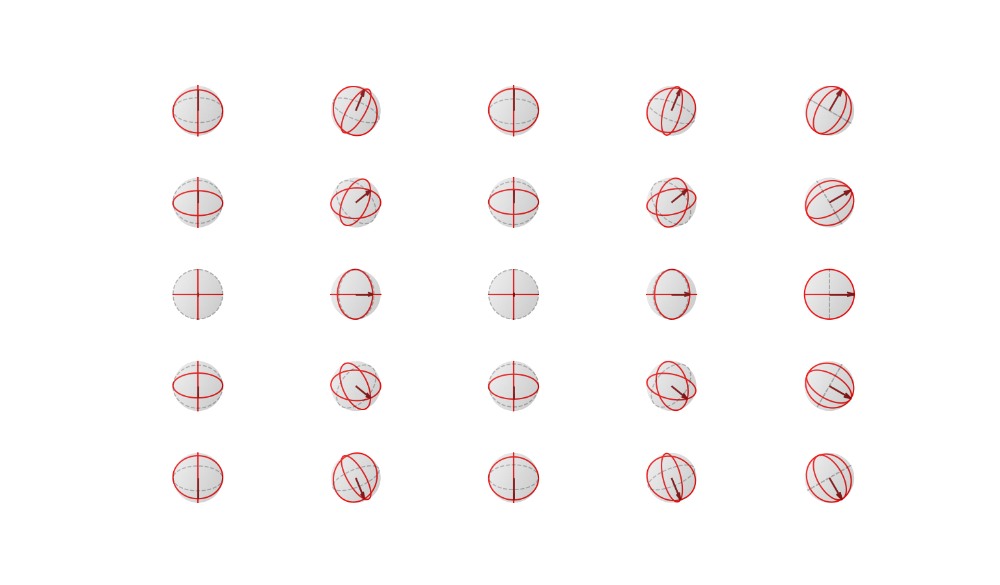

# Sphere Coordinates Visualization

This script visualizes different face directions on a sphere using azimuth and elevation angles. It generates a grid of spheres with various orientations.

## Example Output

